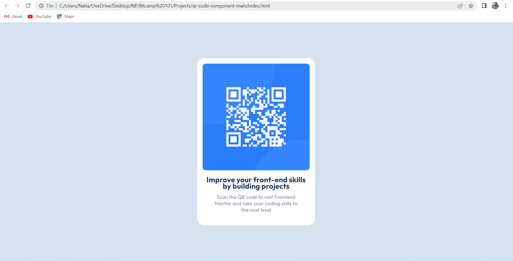

# Frontend Mentor - QR code component solution

This is a solution to the [QR code component challenge on Frontend Mentor](https://www.frontendmentor.io/challenges/qr-code-component-iux_sIO_H). 
I used inline styling of the elements.

To view the live link of the website [Click here](https://natia-purtskhvanidze.github.io/QR-Code-Component-BitCamp101/) 

### Screenshot

### Useful resources

- [The resourse on Freecodecamp](https://www.freecodecamp.org/news/how-to-center-anything-with-css-align-a-div-text-and-more/) - hepled me to learn how to align the div in center

### The challenge
- The lectures and learning materials were provided by lecturers and mentors under [Bitcamp](https://www.bitcamp.ge/) project.
-   სწავლა და ბრძოლა!